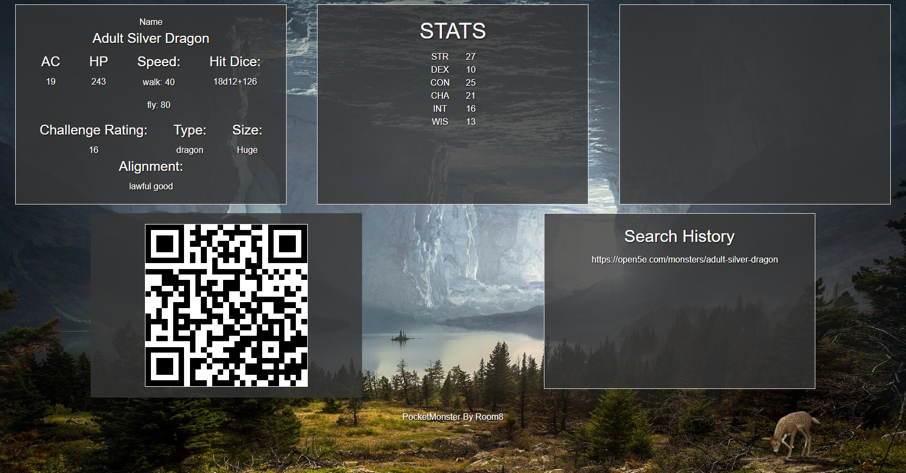

# PocketMonster

Create a QR for a Dungeons and Dragons Monster

## User Story

```
[AS A] Dungeon Master 
[I WANT] to easily generate an Open5e monster 
[SO THAT] I can send it to my players
[GIVEN] I enter the attributes I would like the monster to have 
[WHEN] I click the search button 
[THEN] I am directed to a page with the monster's stats and a QR code that links back to the monster's page.
```
## Project Description
---
On page load, the user will be presented with project title (PocketMonster), a brief description of its function, and a form with dropdown boxes for Open5e monster selection criteria. The last monster that was encountered (searched for) will be displayed on the homepage using local storage.

Upon submission of the form, the user will be directed to a new page with a monster statblock (layout designed by us), and a QR code that links to the original statblock hosted on the Open5e API.


- [PocketMonster Git Hub Repository](https://github.com/areitan/PocketMonster)
- [PocketMonster Deployed Application](https://areitan.github.io/PocketMonster/)


### PocketMonster Initial Page Screenshot


### PocketMonster Results Page Screenshot



## Process
---

### Wireframing

1. After brainstorming for our project idea and deciding on 2 API's.
    * API 1: Open5E Open source resource for the 5th edition Dungeons and Dragons content provided under OGL 1.0a
    * API 2: goQR.me QR code generator
2. We drew out some simple sketches of our potential site.

### Kanban board

1. We decided to use a Kanban Board to help organize and assign tasks.
2. We divided the Kanban Board into 4 sections
    * The "Icebox" is the container for things we'd like to add after we have our minimum viable product. 
    * The "To-Do" container where tasks are waiting to be assigned. 
    * The In-process container is for things we're working on and that are assigned.
    * The "Completed" container is for items that we feel are complete at t his point.
3. We used the Kanban board to assign tasks and then follow up on them. It was a great way to make sure we didn't forget to handle tasks along the way.    
4. We moved tasks through the containers reflecting the progress of the project.


### index.html and randomizedresults.html

1. index.html is the initial page of our application. The user is presented with option boxes for entering search criteria. On clicking "Encounter", the user is redirected to randomizedresults.html where they will find a QR code for a monster and the monster stats. The last search criteria from index.html are saved in local storage and persist on that page in the "Last Monster Encountered" section.
2. We added id's to the inputs and other areas of the ```HTML``` we wanted our ```.js```  and ```.css``` file to interact with.
3. We added Zurb Foundation classes to structure our pages and add some of the styling.
4. Foundation had a building block template we used to create the translucent effect on the option boxes and the last monster encountered section.


### script.js and randomizedresults.js

1. script.js handles the inputs from index.html, stores that information in local storage, and uses it to fetch information from the Open5e API. That information also is sent to the goQR.me API to return a QR code for the selected monster.
2. randomizedresults.js gets the monster information and displays it on the results page.
3. We added variables for the inputs from ```index.html``` that we needed for traversing the DOM and maintaining user inputs in local storage.
4. We used JSON and the ```localStorage.getItem()``` and ```localStorage.setItem()``` to ouput information into local storage and retrieve it for display.
5. We added an ```if``` statement to set the ```HTML``` elements to display the last saved user inputs. 

### style.css

1. We decided to use tailwind as our CSS framework, but found that installing it wasn't working so in the interest of time, we changed to Zurb Foundation.
2. We added some code from a Foundation building-block template to control the translucent overlay for the form, local storage, and results page displays.
3. We added a background image to enhance the appearance of the application.


## How To Contribute
---

1. Suggestions are welcome. There are several things we wanted to add, but we ran out of time. 
    * We thought it would be nice to include images on the result page for each monster type. We had thought about using the NY Public Library API to do this.
    * We had considered adding conditional color formatting to QR codes. 


## License
---

Copyright (c) ```<2022> <copyright April Reitan, Emily Hoodenpyle, Nikolas Mazus, Jared Teraoka>```

MIT License:
Permission is hereby granted, free of charge, to any person obtaining a copy
of this software and associated documentation files (the "Software"), to deal
in the Software without restriction, including without limitation the rights
to use, copy, modify, merge, publish, distribute, sublicense, and/or sell
copies of the Software, and to permit persons to whom the Software is
furnished to do so, subject to the following conditions:

The above copyright notice and this permission notice shall be included in all
copies or substantial portions of the Software.

THE SOFTWARE IS PROVIDED "AS IS", WITHOUT WARRANTY OF ANY KIND, EXPRESS OR
IMPLIED, INCLUDING BUT NOT LIMITED TO THE WARRANTIES OF MERCHANTABILITY,
FITNESS FOR A PARTICULAR PURPOSE AND NONINFRINGEMENT. IN NO EVENT SHALL THE
AUTHORS OR COPYRIGHT HOLDERS BE LIABLE FOR ANY CLAIM, DAMAGES OR OTHER
LIABILITY, WHETHER IN AN ACTION OF CONTRACT, TORT OR OTHERWISE, ARISING FROM,
OUT OF OR IN CONNECTION WITH THE SOFTWARE OR THE USE OR OTHER DEALINGS IN THE
SOFTWARE.


## Credits
---

- [Open5e](https://open5e.com/)
- [goQR.me](https://goqr.me/api/)
- [Pixabay Free Stock Photos: Image by Stefan Keller](https://pixabay.com/photos/fantasy-cave-mystical-rock-stone-2750995/)
- [Zurb Foundation: Translucent Form Overlay](https://get.foundation/building-blocks/blocks/translucent-form-overlay.html)
- Trilogy Education Services, LLC, a 2U, Inc. brand